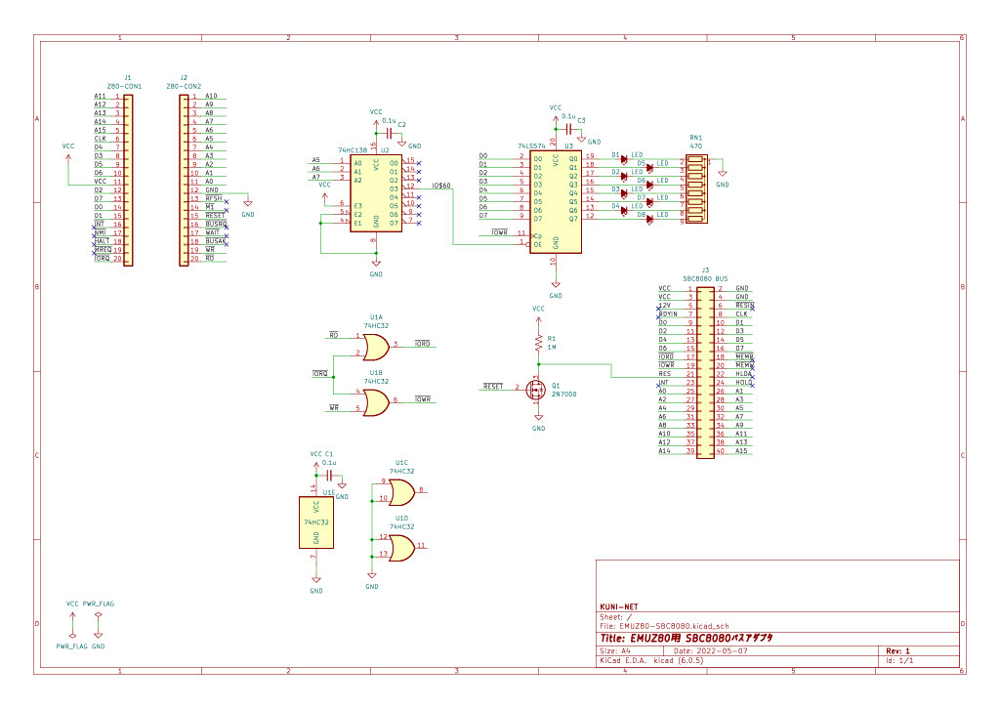

# EMUZ80用 SBC8080バス変換アダプタ & LEDボード

## 概要

* EMUZ80用 SBC8080バス変換アダプタ & LEDボードです。
  * EMUZ80のZ80 CPUの横にあるピンソケットから信号をもらって、SBC8080バスへ変換します。
  * EMUZ80ではメモリー関係はPIC側となってますので、I/O読み取り/書き込み分だけ変換してます。

## 回路図

## 参考リンク

* EMUZ80
  * https://vintagechips.wordpress.com/2022/03/05/emuz80_reference/